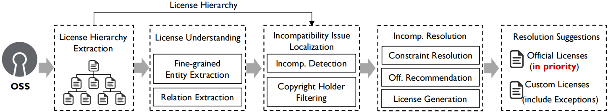

# LiResolver

## Introduction
Open source software (OSS) licenses regulate the conditions under which OSS can be legally reused, distributed, and modified. However, a common issue arises when incorporating third-party OSS accompanied with licenses, i.e., license incompatibility, which occurs when multiple licenses exist in one project and there are conflicts between them. Despite being problematic, fixing license incompatibility issues requires substantial efforts
due to the lack of license understanding and complex package dependency.
In this paper, we propose ***LiResolver***, a fine-grained, scalable, and flexible tool to resolve license incompatibility issues for open source software. Specifically, it first understands the semantics of licenses through fine-grained entity extraction and relation extraction. Then, it detects and resolves license incompatibility issues by recommending official licenses in priority. When no official licenses can satisfy the constraints, it generates a custom license as an alternative solution. Comprehensive experiments demonstrate the effectiveness of LiResolver, with 4.09\% FP rate and 0.02\% FN rate for incompatibility issue localization, and 62.61\% of 230 real-world incompatible projects resolved by LiResolver. Furthermore, we also evaluate the impacts of license hierarchy and copyright holder detection on the effectiveness of incompatibility resolution. We discuss lessons learned and made all the datasets and the replication package of LiResolver publicly available to facilitate follow-up research.

## Features

### Fine-grained license understanding
### Hierarchy incompatibility Detection
### License recommendation and generation

## Installation

#### download dependency files

* download the `roberta-base` pretrained model from website`https://huggingface.co` to the file folder `LiResolver/RE/roberta-base` of LiResolver

* download the `glove` pretrained model from website`https://nlp.stanford.edu/projects/glove/` to the file folder `LiResolver/EE5/LocateTerms/data/glove.6B` of LiResolver

* download the `bert-base-uncased` pretrained model from website`https://huggingface.co` to the file folder `LiResolver/AC/bert-base-uncased` of LiResolver

* download the `corenlp` tool from website`https://stanfordnlp.github.io/CoreNLP/` to the file folder `LiResolver/model/stanford-corenlp-4.2.0` of LiResolver

#### create dependency environment

`conda create --name liresolver python=3.7`

`conda activate liresolver`

`pip install -r requirements.txt`

#### Run LiResolver

**Input:** 

place the OSS project you want to analyze into the folder `LiResolver/repos/`, and run

`cd LiResolver`

`python3 main.py`

**Output:**

The incompatibility resolution results will write into the folder `LiResolver/REPAIRED/` and other processing information will output on the console. 

## Example

For example, in the OSS project `jekyc/wig`, after license understanding step, we found that it claims a project license in the LICENSE text, which is similar to _BSD-2-Clause_, and 
there are other licenses for its imported third-party packages, e.g., _re_, _urllib_, _hashlib_ in the code file _wig-master/wig/classes/request2.py_, 
which are licensed as _BSD-3-Clause_, _MIT-license_, _Python Software Foundation License_, respectively. 
Among them, the license terms of _BSD-3-Clause_ and _Python Software Foundation License_ are both stricter than that of _BSD-2-Clause_, 
thus triggering license incompatibility issues. Here, **LiResolver can help resolve it by recommanding some proper official licenses** 
for the project license, for instance, GNU Lesser General Public License v2.1, Zope Public License 2.1, Python Software Foundation License 2.0 .etc. 

In the OSS project `facebookresearch/torchbeast`, the code file _torchbeast-main/torchbeast/monobeast.py_ has a inline license for its own, 
and there are other licenses for its imported third-party packages, e.g., _traceback_, _torch_, 
which are licensed as _Python Software Foundation License_, _BSD-3-Clause_, respectively. As the license understanding and incompatibility localization steps, 
the license terms of _monobeast.py_ are not compatible with its component licenses above, and **LiResolver can help solve it by generating a custom license** 
because of the absence of proper official licenses, which can be showed as: 
_This license claims that you can distribute, modify, commercial use, rename, compensate for damages, disclose source, include notice, include original, give credit, contact author, include install instructions, compensate for damages, pay above use threshold. This license claims that you must include copyright for this, include license for this, state changes. This license claims that you cannot hold liable, sublicense, use trademark, private use, place warranty, use patent claims, relicense, statically link._
